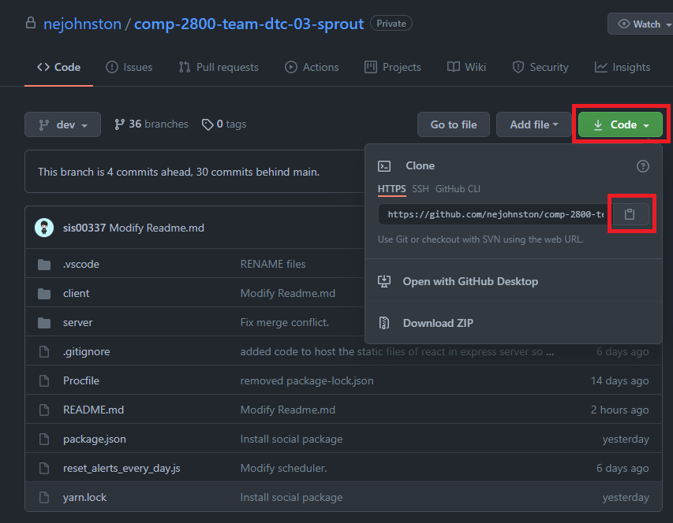
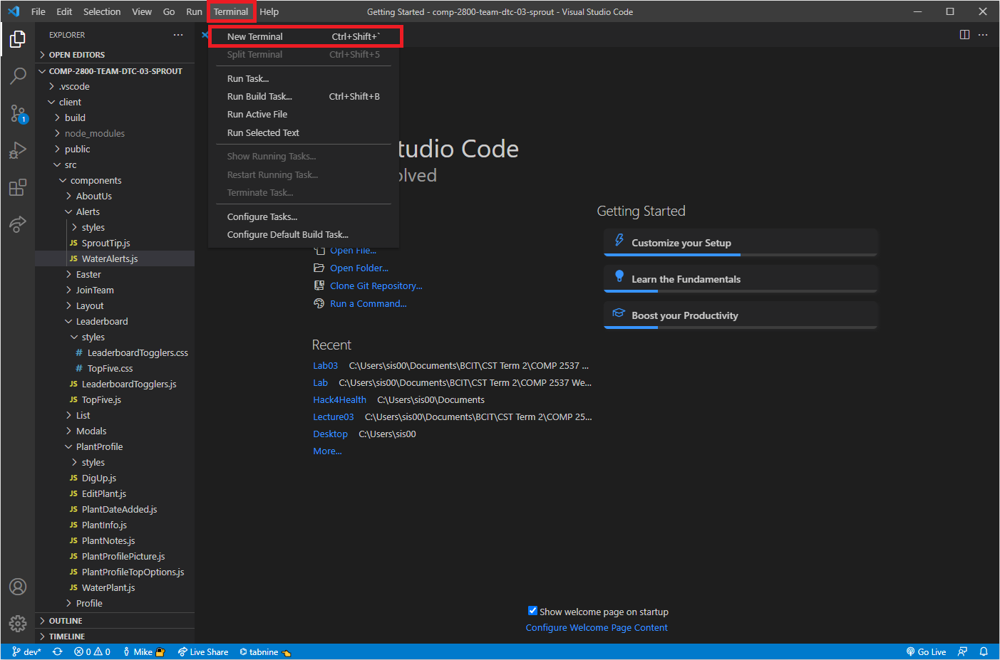
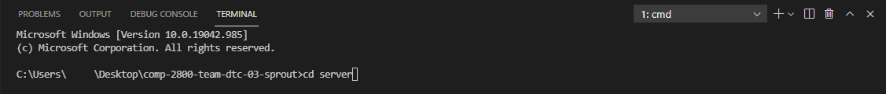
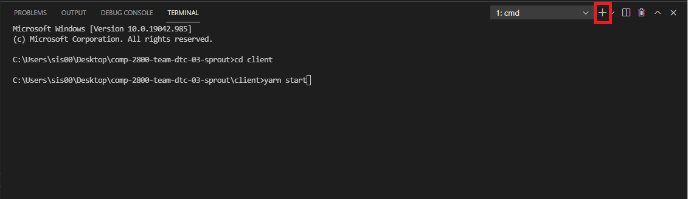
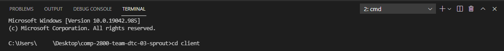

## 🌱 Sprout
* ⭐ [General Info](#general-info)
* ⚙ [Technologies](#technologies)
* ✏ [Design](#design)
* 🗃 [Databases](#databases)
* 📝[Testing](#testing)
* 📁 [Content](#content)
* [:running: Install Steps](#Install-steps)


## ⭐ General Info
SPROUT connects gardeners of all ages and expertise with resources on the best native and bee-friendly plants for their local area. Users will join community teams and earn points while learning and engaging in sustainable gardening.

## ⚙ Technologies
Technologies/languages used for this project:

### VSC (Visual Studio Code)
Visual Studio Code is a source-code editor that is compatible with a variety of programming languages, including Java, JavaScript, Go, Node.js, Python and C++.

### JSX
JSX allows us to render JS objects in HTML. This makes it easier to write React components and leverage props and states within the component's HTML.

### React
React is a flexible, agile, Javascript framework used to make UI Interfaces. It enables us to build small components that can display information based on props and state, which makes templating much easier. This will be advantageous for us as we will be passing around a lot of information such as plant information, user data, and images.

For our implementation of React, we will be relying on React Hooks rather than the decprecated Class methods. The two Hooks we will be working with for this development will be the useState and useEffect Hooks. This will us to control our components based on dynamic variable handling, and will ensure that they retain maximum flexibility without bloat.

## ✏ Design
For containers, the design we will be using is an encompassing component surrounding a single component. This makes passing props simple and building a page much easier as it separates.

This project was bootstrapped with [Create React App](https://github.com/facebook/create-react-app).

### React State
State is built in to React Components. Using state we can add value attributes to our components. When state is updated, the component re-renders. For example, this will be useful for Adding Sprouts in our application. 

### React Component Lifecycles
Working hand in hand with state management is the useEffect hook, which we will be using to maintain and control our component lifecycles. The useEffect hook simply executes events depending on the current state, on mounting/unmounting a component, or if a specific state is changed. Furthermore, it allows us to clean up code (like event handlers) after a function is fired off, which prevents the application from crashing!

### React Bootstrap
We borrow from the React Bootstrap library for some of our design components. More can be found here (https://react-bootstrap.github.io/)

### Heroku
Heroku is a container-based cloud platform as a service (PaaS). Heroku allows developers to deploy, manage, and extend the applications.

## 🗃 Databases

### Heroku PostgreSQL
Heroku PostgreSQL is a PostgreSQL-based cloud database service. Heroku Postgres offers features such as rollback, high availability, and continuous protection, as well as followers, data clips, and forks.

### Cloudinary
We use Cloudinary to store and manage all user's image uploads. To upload an image to Cloudinary, a POST request must be made Sprout's Cloudinary with an image preset of either sproutPlant or sproutUser. You can see credentials in **Configurations**. If you would like to create more image presets please notify the github owner, Nicholas.

## 📝Testing
You can find our initial testing plan here: https://docs.google.com/spreadsheets/d/1VK1SMwL3B4feiTA7hIC6xo1Rk5iDve64pFtSdyGjAUQ/edit?usp=sharing

## 📁 Content
The repo is organized in a fashion that abides by React structures. First, the repo is split into two sides: client and server.

**Server** contains all related files to the server side of the application. This includes a file for pghelpers, the server.js, and other database-related files.

**Client** contains the application's root folder, components, assets, front-end tests, and containers for the entire web app.

**Containers** folder within the client folder is where you will find the pages that contain components, categorized by each page. Each folder contains 3-4 files. There should be the Page React component, the Page Container, and index.js, and a Styling .css file for each container.
**Components** folder within the client folder is where you will find the smaller components that are used, categorized by the page it is used in. Within this folder, there is also a styles folder for each component.


Content of the project folder:
```
 Top level of project folder: 
📂 /
├── .gitignore                          # Git ignore file
├── package.json                        # Metadata relevant to the project
├── Procfile                            # Basic command for Heroku
├── yarn.lock                           # Managing dependencies
├── reset_alerts_every_day.js           # A JavaScript file that triggers the scheduler
└── README.md                           # You're reading this now!

It has the following subfolders and files:
📂 /
├── 📂 client                            # Folder for the front end
┃    ├─── 📂 src                         # Folder for the source files
┃    ┃     ├── 📂 components             # Folder for the React components
┃    ┃     ├── 📂 AboutUs                # Folder for the AboutUs component
┃    ┃     ├── 📂 Alerts                 # Folder for the Alerts component
┃    ┃     ├── 📂 Easter                 # Folder for the Easter component
┃    ┃     ├── 📂 JoinTeam               # Folder for the JoinTeam component
┃    ┃     ├── 📂 Layout                 # Folder for the Layout component
┃    ┃     ├── 📂 Leaderboard            # Folder for the Leaderboard component
┃    ┃     ├── 📂 List                   # Folder for the List component
┃    ┃     ├── 📂 Modals                 # Folder for the Modals component
┃    ┃     ├── 📂 PlantProfile           # Folder for the PlantProfile component
┃    ┃     ├── 📂 Profile                # Folder for the Profile component
┃    ┃     ├── 📂 Search                 # Folder for the Search component
┃    ┃     └── 📂 SearchPlantDetail      # Folder for the SearchPlantDetail component
┃    ├─── 📂 config                      # Folder for the static data
┃    ┃     ├── 📂 assets                 # Folder for the image files used in the project
┃    ┃     └── 📂 data                   # (AKA RESOURCES) Folder for the JSON files used in the project                
┃    ├─── 📂 containers                  # Folder for the React containers
┃    ┃     ├── 📂 AboutUs                # Folder for the AboutUs page
┃    ┃     ├── 📂 Alerts                 # Folder for the Alerts page
┃    ┃     ├── 📂 HomeContainer          # Folder for the Home page
┃    ┃     ├── 📂 JoinTeam               # Folder for the JoinTeam page
┃    ┃     ├── 📂 Leaderboards           # Folder for the Leaderboards page
┃    ┃     ├── 📂 Login                  # Folder for the Login page
┃    ┃     ├── 📂 PlantProfile           # Folder for the PlantProfile page
┃    ┃     ├── 📂 Profile                # Folder for the Profile page
┃    ┃     ├── 📂 Search                 # Folder for the Search page
┃    ┃     ├── 📂 SearchPlantDetail      # Folder for the SearchPlantDetail page
┃    ┃     └── 📂 Signup                 # Folder for the Signup page
┃    ├─── 📂 components                  # Folder for the React components for each respective page
┃    ┃     ├── 📂 AboutUs                # Folder for the AboutUs page
┃    ┃     ├── 📂 Alerts                 # Folder for the Alerts page
┃    ┃     ├── 📂 HomeContainer          # Folder for the Home page
┃    ┃     ├── 📂 JoinTeam               # Folder for the JoinTeam page
┃    ┃     ├── 📂 Leaderboards           # Folder for the Leaderboards page
┃    ┃     ├── 📂 Login                  # Folder for the Login page
┃    ┃     ├── 📂 Modals                 # Folder for shared Modals across pages
┃    ┃     ├── 📂 PlantProfile           # Folder for the PlantProfile page
┃    ┃     ├── 📂 Profile                # Folder for the Profile page
┃    ┃     ├── 📂 Search                 # Folder for the Search page
┃    ┃     ├── 📂 SearchPlantDetail      # Folder for the SearchPlantDetail page
┃    ┃     └── 📂 Signup                 # Folder for the Signup page     
┃    ├─── 📂 tests                      # Folder for client-side tests        
┃    ├─── index.css                      # A CSS file for the root page
┃    ├─── index.js                       # A JavaScript file for the root page
┃    ├─── Splash.js                      # A JavaScript file for loading the page
┃    ├─── package-lock.json              # Managing dependencies
┃    ├─── package.json                   # Metadata relevant to the project
┃    └─── yarn.lock                      # Managing dependencies
└── 📂 server                            # Folder for the back end
     ├─── 📂 data                        # Folder for the static data
     ├─── 📂 database                    # Folder for showing how the database looks
     ├─── package-lock.json              # Managing dependencies
     ├─── package.json                   # Metadata relevant to the project
     ├─── pghelper.js                    # A JavaScript file for querying from the database
     ├─── server.js                      # A JavaScript file for connecting to the server
     └─── yarn.lock                      # Managing dependencies

```
## Configurations
# Heroku
# Cloudinary
Any upload to images must be a POST request to: https://api.cloudinary.com/v1_1/sprout03/image/upload/
Username: sprout.team.3@gmail.com
Password: BCITcomp2800!

## Install Steps
1. Clone the repository to your local device.   
</img>
2. Open your Visual Studio Code(VSC) and open a terminal.   
</img>
 
3. Type ***cd server***, ***yarn install***, and ***yarn start*** consequently.   
</img>   
</img>   
</img>
      
    
   
   Once you run ***yarn install***, you do not need to run that again from the next time.
4. Open another terminal by clicking ```+``` button on the top-right in the terminal.    
</img>
5. Type ***cd client***, ***yarn install***, and ***yarn start*** consequently. This will automatically install all of Sprout's dependencies on your local computer. To see a list of all these dependencies, you may read package.json.
</img>   
</img>   
</img>
    
    
   
   Once you run ***yarn install***, you do not need to run that again from the next time.
   There are also no 

Then you will see the home page of Sprout!   
</img>   